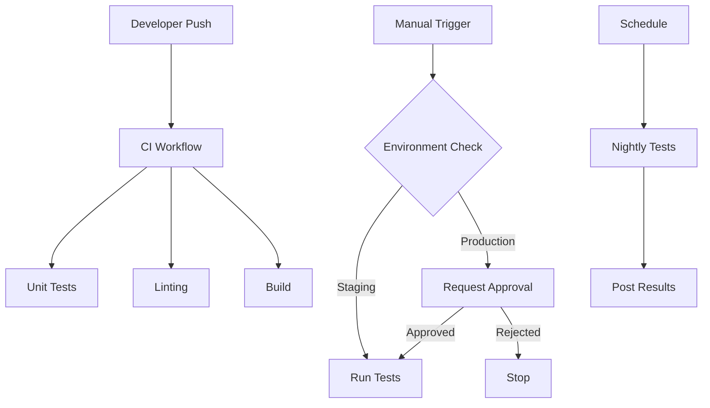

# GitHub Actions Integration Testing Demo

This repository demonstrates best practices for setting up GitHub Actions with manual triggers, environment protection, and integration testing.

## 🎯 Purpose

Show how to:
- Configure manual workflow triggers
- Use GitHub Environments for approval workflows
- Run integration tests selectively
- Protect sensitive credentials

## 🚀 Quick Start

### 1. Fork/Create This Repository

```bash
# Clone the template
git clone <your-repo-url>
cd <your-repo>

# Initialize with the provided structure
cp -r /tmp/.github .
cp /tmp/CLAUDE.md .
cp /tmp/README_DEMO.md README.md
```

### 2. Configure GitHub Environments

1. Go to **Settings** → **Environments**
2. Create `integration-testing` environment
3. Add protection rules:
   - ✅ Required reviewers (add your username)
   - 🕐 Wait timer (optional, e.g., 5 minutes)
   - 🌿 Deployment branches (e.g., only from main)

### 3. Add Repository Secrets

Go to **Settings** → **Secrets and variables** → **Actions**

#### For S3 Testing:
- `AWS_ACCESS_KEY_ID`
- `AWS_SECRET_ACCESS_KEY`
- `TEST_S3_BUCKET`

#### For Database Testing:
- `DB_CONNECTION_STRING` (optional if using service container)

#### For API Testing:
- `API_KEY`
- `API_ENDPOINT`

### 4. Create Sample Application

```go
// src/main.go
package main

import (
    "fmt"
    "os"
    
    "github.com/aws/aws-sdk-go/aws"
    "github.com/aws/aws-sdk-go/aws/session"
    "github.com/aws/aws-sdk-go/service/s3"
)

func main() {
    sess := session.Must(session.NewSession())
    svc := s3.New(sess)
    
    result, err := svc.ListBuckets(nil)
    if err != nil {
        fmt.Printf("Error: %v\n", err)
        os.Exit(1)
    }
    
    fmt.Println("Buckets:")
    for _, bucket := range result.Buckets {
        fmt.Printf("  %s\n", *bucket.Name)
    }
}
```

### 5. Create Tests

```go
// tests/integration_test.go
// +build integration

package tests

import (
    "flag"
    "os"
    "testing"
)

var (
    runS3 = flag.Bool("s3", false, "Run S3 tests")
    bucket = flag.String("bucket", os.Getenv("TEST_S3_BUCKET"), "S3 bucket")
)

func TestS3Operations(t *testing.T) {
    if !*runS3 {
        t.Skip("S3 tests not enabled")
    }
    
    if *bucket == "" {
        t.Fatal("TEST_S3_BUCKET not set")
    }
    
    // Your test implementation
    t.Logf("Testing with bucket: %s", *bucket)
}
```

## 📋 Usage

### Running Tests Locally

```bash
# Unit tests only
go test ./...

# Integration tests with S3
go test -tags=integration ./tests -s3 -bucket=my-test-bucket

# With mock S3 (using MinIO)
docker run -d -p 9000:9000 minio/minio server /data
export AWS_ACCESS_KEY_ID=minioadmin
export AWS_SECRET_ACCESS_KEY=minioadmin
go test -tags=integration ./tests -s3 -endpoint=http://localhost:9000
```

### Triggering Manual Tests

1. Go to **Actions** tab
2. Select **Manual Integration Tests**
3. Click **Run workflow**
4. Fill in options:
   - PR number (optional)
   - Which tests to run
5. Click **Run workflow**

### With Environment Protection

If you've configured required reviewers:
1. Workflow starts and requests approval
2. Designated reviewers get notified
3. Reviewer approves in Actions tab
4. Tests run with production credentials

## 🏗️ Architecture



## 🔒 Security Best Practices

1. **Never commit secrets** - Use GitHub Secrets
2. **Use environments** - Separate staging/production
3. **Limit access** - Configure CODEOWNERS
4. **Audit trail** - Review deployment history
5. **Rotate credentials** - Regular secret rotation

## 📊 Test Organization

| Test Type | Trigger | Requires Secrets | Environment |
|-----------|---------|------------------|-------------|
| Unit | Every push | No | None |
| Integration (Mock) | Every push | No | None |
| Integration (Real) | Manual/Schedule | Yes | `integration-testing` |
| Production | Manual only | Yes | `production-integration` |

## 🎭 Demo Scenarios

### Scenario 1: PR Testing
1. Create feature branch
2. Open PR
3. Automatic tests run (unit + mock)
4. Request manual integration tests
5. Maintainer approves and runs
6. Results posted to PR

### Scenario 2: Production Testing
1. Select production environment
2. Requires additional approval
3. Uses production-like data
4. Full test suite runs
5. Results archived

## 🐛 Troubleshooting

### Workflow not appearing
- Ensure workflow file is in `.github/workflows/`
- Check YAML syntax
- Verify you have Actions enabled

### Environment not found
- Name must match exactly
- Check spelling and case

### Secrets not accessible
- Verify secret names
- Check environment assignment
- Ensure approval if required

### PR checkout failing
- Verify PR number is correct
- Check repository permissions
- Ensure PR is from same repo (not fork)

## 📚 Resources

- [GitHub Actions Documentation](https://docs.github.com/actions)
- [Environment Protection Rules](https://docs.github.com/actions/deployment/environments)
- [workflow_dispatch Event](https://docs.github.com/actions/using-workflows/events-that-trigger-workflows#workflow_dispatch)
- [Using Secrets](https://docs.github.com/actions/security-guides/encrypted-secrets)

## 🤝 Contributing

This is a demo repository. Feel free to:
- Fork and adapt for your needs
- Submit improvements via PR
- Report issues
- Share your adaptations

## 📄 License

MIT - Use this template freely for your projects