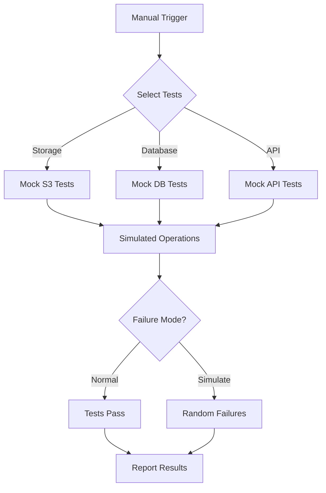

# GitHub Actions Integration Testing Demo (Simulated)

This repository demonstrates how to set up GitHub Actions with manual triggers and simulated integration tests that don't require real external services or credentials.

## 🎯 Purpose

Show how to:
- Configure manual workflow triggers with `workflow_dispatch`
- Use GitHub Environments for approval workflows
- Run simulated integration tests without real credentials
- Test integration patterns without actual external dependencies

## ✨ Key Features

- **No Real Credentials Required** - All tests use mock services
- **Configurable Failure Simulation** - Test your error handling
- **Manual Test Triggers** - Run specific test suites on demand
- **Environment Protection** - Demo approval workflows
- **PR Integration** - Test pull requests with manual triggers

## 🚀 Quick Start

### 1. Fork/Clone This Repository

```bash
git clone https://github.com/digitaldrywood/github-integration-testing-demo
cd github-integration-testing-demo
```

### 2. Configure GitHub Environments (Optional)

For demonstrating approval workflows:

1. Go to **Settings** → **Environments**
2. Create `integration-testing` environment
3. Add protection rules (optional):
   - ✅ Required reviewers
   - 🕐 Wait timer
   - 🌿 Deployment branches

### 3. No Secrets Required!

This demo uses simulated services, so no real credentials are needed. The workflows will run without any configuration.

## 📋 Usage

### Running Tests Locally

```bash
# Run the main application (simulated services)
go run src/main.go

# Unit tests only
go test ./tests

# Integration tests with simulated storage
go test -tags=integration ./tests -storage

# Integration tests with simulated database
go test -tags=integration ./tests -database

# Integration tests with simulated API
go test -tags=integration ./tests -api

# Run all integration tests
go test -tags=integration ./tests -storage -database -api

# Run with simulated failures
go test -tags=integration ./tests -storage -fail

# Verbose output
go test -tags=integration ./tests -storage -v
```

### Triggering Manual Tests via GitHub Actions

1. Go to the **Actions** tab in your repository
2. Select **Manual Integration Tests**
3. Click **Run workflow**
4. Choose options:
   - **PR number** (optional) - Test a specific PR
   - **Storage tests** - Run simulated storage tests
   - **Database tests** - Run simulated database tests
   - **API tests** - Run simulated API tests
   - **Simulate failures** - Enable random test failures
5. Click **Run workflow**

The tests will run immediately without requiring any credentials or external services!

## 🏗️ Architecture



## 🧪 Test Structure

### Simulated Services

The demo includes three types of simulated services:

1. **Storage Service** (S3-like)
   - Upload/Download operations
   - List objects
   - Metadata operations
   - 1% simulated failure rate

2. **Database Service** (PostgreSQL-like)
   - Connection testing
   - CRUD operations
   - Transactions
   - Performance testing
   - 2% simulated failure rate

3. **External API** (REST-like)
   - Authentication
   - GET/POST/PUT/DELETE
   - Rate limiting
   - 5% simulated failure rate

### Test Flags

| Flag | Description | Example |
|------|-------------|---------|
| `-storage` | Run storage tests | `go test -tags=integration ./tests -storage` |
| `-database` | Run database tests | `go test -tags=integration ./tests -database` |
| `-api` | Run API tests | `go test -tags=integration ./tests -api` |
| `-fail` | Simulate random failures | `go test -tags=integration ./tests -storage -fail` |
| `-v` | Verbose output | `go test -tags=integration ./tests -storage -v` |

## 🎭 Demo Scenarios

### Scenario 1: Manual Test Trigger

1. Go to Actions tab
2. Run workflow with desired options
3. Watch tests execute with simulated delays
4. Review test results

### Scenario 2: PR Testing

1. Create a pull request
2. Note the PR number
3. Trigger manual tests with PR number
4. Tests checkout PR code and run
5. Results posted back to PR

### Scenario 3: Failure Simulation

1. Enable "Simulate failures" option
2. Watch some tests randomly fail
3. Use for testing error handling and retry logic

### Scenario 4: Environment Protection Demo

1. Configure environment with required approvers
2. Trigger workflow
3. Approval request sent
4. Approve and watch tests run

## 📊 What's Being Simulated

Each test simulates realistic operations with:
- **Response delays** - Mimics network latency
- **Operation steps** - Shows progress through tasks
- **Random failures** - Optional failure simulation
- **Resource names** - Realistic service naming

Example output:
```
=== RUN   TestStorageIntegration/Upload
    Starting Storage Upload integration test
    ✓ Connecting to storage service
    ✓ Generating test file
    ✓ Uploading file
    ✓ Verifying upload
    ✓ Checking file integrity
    ✅ Storage Upload integration test passed
--- PASS: TestStorageIntegration/Upload (0.50s)
```

## 🔧 Customization

### Adjusting Failure Rates

Edit `tests/integration_test.go`:
```go
NewMockIntegrationTest("Storage Upload", 500*time.Millisecond, 0.05) // 5% failure rate
```

### Adding New Mock Services

1. Add new service configuration in `src/main.go`
2. Create corresponding test functions in `tests/integration_test.go`
3. Add workflow trigger option in `.github/workflows/integration-manual.yml`

### Changing Response Times

Modify the duration parameter:
```go
NewMockIntegrationTest("Quick Test", 100*time.Millisecond, 0.01)
```

## 🐛 Troubleshooting

### Tests not running
- Ensure you're using the `-tags=integration` flag
- Check that test flags are provided (e.g., `-storage`)

### Workflow not appearing
- Verify workflow file is in `.github/workflows/`
- Check YAML syntax
- Ensure Actions are enabled in repository settings

### No output from tests
- Add `-v` flag for verbose output
- Check test timeouts

## 📚 Key Concepts Demonstrated

1. **Manual Workflow Triggers** - Using `workflow_dispatch`
2. **Input Parameters** - Collecting user input for workflows
3. **Conditional Jobs** - Running jobs based on inputs
4. **Environment Protection** - Optional approval workflows
5. **PR Testing** - Checking out and testing PR code
6. **Test Organization** - Using build tags and flags
7. **Mock Services** - Testing without external dependencies

## 🤝 Contributing

This is a demo repository designed for learning. Feel free to:
- Fork and adapt for your needs
- Submit improvements via PR
- Report issues
- Share your adaptations

## 📄 License

MIT - Use this template freely for your projects